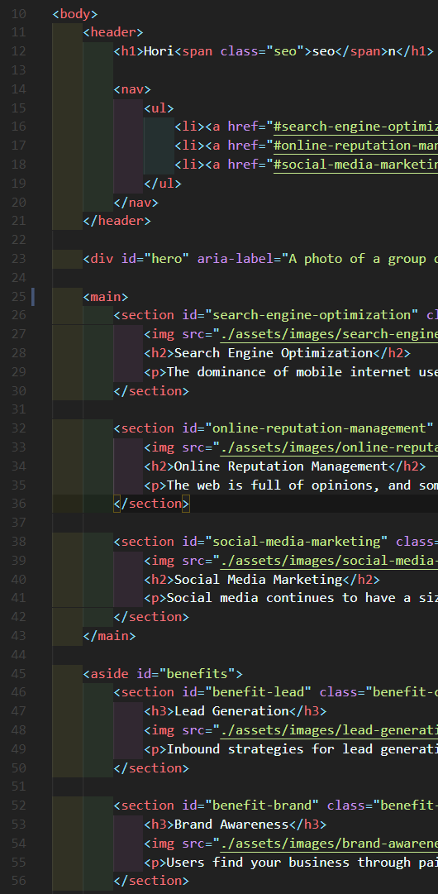

# UWCB-HW01-Code_Refactor
Homework assignment for **week 1** of _UW Coding Bootcamp_.
---
## TASK
Refactor a codebase so that it follows accessibility standards and the site is optimized for search engines.

## Links
You can see the **[ORIGINAL](https://tomakpo.github.io/UWCB-HW01-Code_Refactor/original_site/)** site or the **[UPDATED](https://tomakpo.github.io/UWCB-HW01-Code_Refactor/updated_site/)** site.
Or you can also see the **[GitHub repo](https://github.com/ToMakPo/UWCB-HW01-Code_Refactor)** for this project.

## Changes Made
### HTML
- Changed the <code>div</code> tags to semantic HTML elements like <code>header</code> and <code>section</code>.
- Added spacing between HTML elements to make it easyer to read.
- Changed class names to ids where appropriate.
- Added class names to like elements to help group them together.
- Added <code>alt</code> attributes to images to assist those with vision imparments.
- Changed the <code>title</code> to one that is more discriptive of the website.
- Checked that all of the links work as intended.

 

### CSS
- Added comments to help group different parts of the code.
- Moved certain items around to make sure it follows a logical structure. 
- Combined reapeating code to go to specific classes instead of each individual element.

 
